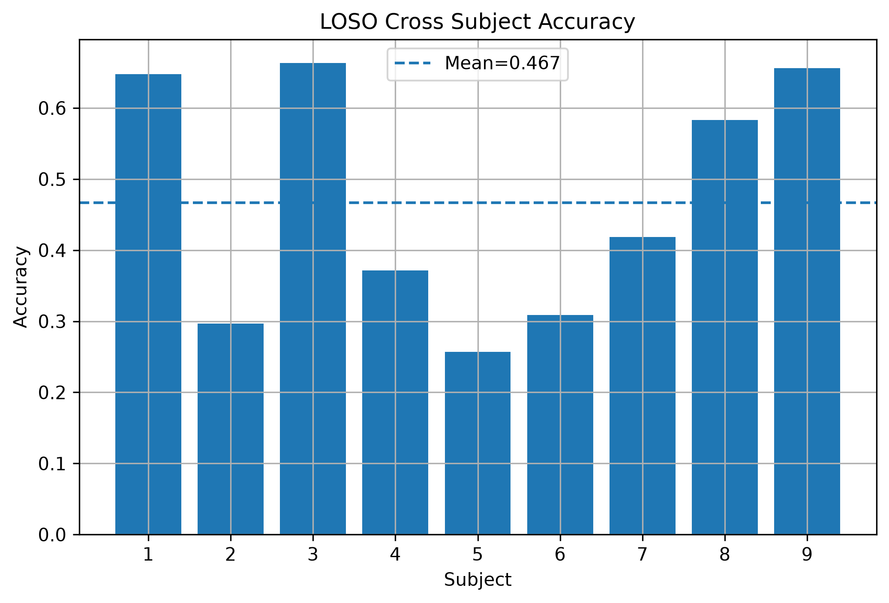
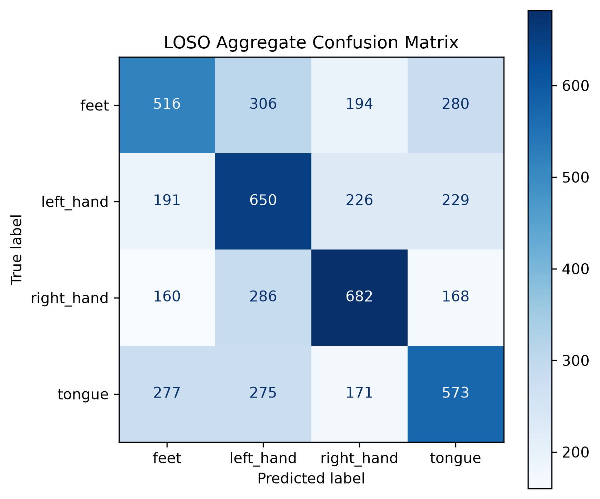

# 基于 MOABB 与 Braindecode 的运动想象脑电分类研究

## 项目简介

本项目面向**运动想象脑机接口（Motor Imagery Brain-Computer Interface，MI-BCI）**，基于公开数据集 **BNCI2014_001（BCI Competition IV 2a）**，使用 **MOABB、MNE、Braindecode、Scikit-learn 与 PyTorch**，复现从脑电数据读取、信号预处理、传统机器学习建模，到深度学习训练和跨被试评价的完整实验流程。

项目现已完成：

- CSP + SVM 传统机器学习基线；
- EEGNet 与 ShallowFBCSPNet 深度学习实验；
- 指数移动标准化（Exponential Moving Standardization，EMS）；
- Braindecode Cropped Training；
- 单被试跨会话实验；
- 9 被试跨会话实验；
- 9 折 LOSO 跨被试实验；
- 训练曲线、被试准确率与混淆矩阵可视化；
- 模型参数与实验指标保存。

本项目重点不只是获得单次分类结果，而是建立一套**可重复、可比较、可扩展的运动想象 EEG 实验框架**。

---

## 一、研究目标

本项目主要完成以下任务：

1. 使用 MOABB 自动下载和管理公开脑电数据集；
2. 使用 MNE 与 Braindecode 读取真实 EEG 数据；
3. 分析被试、会话、运行、通道、采样率和事件标签；
4. 将连续脑电信号切分为独立运动想象试次；
5. 完成 EEG 通道筛选、带通滤波和动态标准化；
6. 使用 CSP 提取空间特征，并通过 SVM 完成传统分类基线；
7. 使用 EEGNet 和 ShallowFBCSPNet 完成深度学习分类；
8. 使用 WindowsDataset、Dense Prediction 和 CroppedLoss 实现 Cropped Training；
9. 完成单被试、多被试跨会话及 LOSO 跨被试评价；
10. 保存模型、训练历史、混淆矩阵和汇总指标；
11. 为后续迁移学习、领域自适应和实时 BCI 推理奠定基础。

---

## 二、数据集

本项目使用 **BNCI2014_001** 数据集，也称为 **BCI Competition IV 2a**。

| 项目 | 数据 |
| --- | --- |
| 被试数量 | 9 |
| 每名被试会话数 | 2 |
| 每个会话运行数 | 6 |
| 每个运行试次数 | 48 |
| 每名被试总试次数 | 576 |
| 全部被试总试次数 | 5184 |
| 运动想象类别 | 4 类 |
| EEG 通道 | 22 |
| EOG 通道 | 3 |
| 刺激通道 | 1 |
| 采样率 | 250 Hz |
| 单次试次时间范围 | 0～4 s |
| 单次试次采样点 | 1001 |

四类运动想象任务为：

- `feet`
- `left_hand`
- `right_hand`
- `tongue`

MOABB 在首次运行时会自动下载数据。未单独设置数据目录时，数据通常保存在用户目录下的 MNE 数据文件夹中，不直接写入本仓库。

---

## 三、实验环境

本项目当前实验环境记录如下：

| 软件 | 版本 |
| --- | --- |
| Python | 3.11.9 |
| PyTorch | 2.13.0+cpu |
| MOABB | 1.5.0 |
| Braindecode | 1.7.0 |
| MNE | 1.12.1 |
| NumPy | 2.4.6 |
| Pandas | 3.0.5 |
| Scikit-learn | 1.9.0 |
| 操作系统 | Windows 11 |

当前实验主要在 CPU 环境中运行，后续可迁移至 CUDA GPU。

---

## 四、总体技术路线

```text
BNCI2014_001 原始 EEG
            ↓
      MOABB 自动下载与管理
            ↓
       MNE / Braindecode 读取
            ↓
解析 Subject / Session / Run / Event
            ↓
       EEG 通道筛选与单位转换
            ↓
       4～38 Hz 带通滤波
            ↓
  Exponential Moving Standardization
            ↓
      Epoch / WindowsDataset 构建
            ↓
 ┌───────────────────────────────┐
 │  CSP + SVM                    │
 │  EEGNet                       │
 │  ShallowFBCSPNet              │
 │  ShallowFBCSPNet + Cropped    │
 └───────────────────────────────┘
            ↓
单被试 / 跨会话 / LOSO 跨被试评价
            ↓
 Accuracy / Macro-F1 / 混淆矩阵
```

---

## 五、数据预处理

### 1. EEG 通道筛选

原始记录包含：

```text
22 EEG + 3 EOG + 1 Stim = 26 通道
```

建模时仅保留 22 个 EEG 通道，避免眼电通道和刺激通道对模型产生干扰。

### 2. 单位转换

MNE 中 EEG 信号默认以伏特（V）存储。Braindecode 深度学习流程中将信号转换为微伏（μV）：

```text
V × 1e6 → μV
```

### 3. 带通滤波

传统 CSP-SVM 基线主要使用：

```text
8～30 Hz
```

Braindecode Cropped Training 流程使用：

```text
4～38 Hz
```

该范围覆盖与运动想象相关的 μ 节律和 β 节律。

### 4. 指数移动标准化

采用 Braindecode 的：

```text
Exponential Moving Standardization
```

用于动态调整 EEG 信号的均值和方差，减小信号漂移、采集状态变化和幅值尺度差异的影响。

### 5. Epoch 与窗口构建

普通 Epoch 数据形状为：

```text
样本数 × 22 通道 × 1001 时间点
```

例如单个运行：

```text
48 × 22 × 1001
```

在 Cropped Training 中，模型使用较长计算窗口并输出多个密集时间预测，最终对同一 trial 内的多个 crop 预测进行融合，得到 trial-level 分类结果。

---

## 六、模型与方法

### 1. CSP + SVM

传统运动想象分类流程：

```text
EEG
 ↓
带通滤波
 ↓
CSP 空间滤波
 ↓
对数方差特征
 ↓
SVM 四分类
```

CSP + SVM 用于建立传统机器学习基线，并与深度学习模型进行比较。

### 2. EEGNet

EEGNet 是面向 EEG 设计的轻量级卷积神经网络，主要包含：

```text
时间卷积
  ↓
深度空间卷积
  ↓
可分离卷积
  ↓
全连接分类
```

其特点是参数量较小，能够联合学习时间和空间特征。

### 3. ShallowFBCSPNet

ShallowFBCSPNet 将 FBCSP 的思想融入卷积网络，主要结构包括：

```text
时间卷积
  ↓
空间卷积
  ↓
平方非线性
  ↓
平均池化
  ↓
对数变换
  ↓
分类输出
```

该模型适合学习与运动想象相关的频带功率和空间模式。

### 4. Cropped Training

Braindecode Cropped Training 的核心流程为：

```text
ShallowFBCSPNet
        ↓
to_dense_prediction_model()
        ↓
多个时间位置的密集预测
        ↓
CroppedLoss
        ↓
Trial-level prediction
```

相较于每个 trial 仅产生一次预测，Cropped Training 能够更充分利用 trial 内的时序信息。

---

## 七、实验设计

### 1. 单被试随机划分

将同一被试或混合被试的 trial 随机划分为训练集和测试集。

该方法适合快速验证模型能否正常学习，但训练集和测试集可能包含相同被试，因此不能直接代表跨被试泛化能力。

### 2. 单被试跨会话

使用同一被试的：

```text
0train 会话 → 训练
1test 会话  → 验证
```

用于评价模型对同一用户不同采集会话的泛化能力。

### 3. 多被试跨会话

使用 9 名被试的：

```text
全部 0train 会话 → 训练
全部 1test 会话  → 验证
```

该实验评价模型在已见被试上的跨会话表现。

### 4. LOSO 跨被试

采用 Leave-One-Subject-Out：

```text
8 名被试 → 训练
1 名完全未见被试 → 测试
```

共进行 9 折。每一折都将不同被试作为独立测试对象。

为避免测试被试参与模型选择，每一折分为三个阶段：

1. 使用训练被试的 `0train` 和 `1test` 会话选择最佳 epoch；
2. 使用 8 名训练被试的全部会话重新训练新模型；
3. 在保留被试的全部数据上进行最终 trial-level 测试。

---

## 八、实验结果

### 1. CSP + SVM

| 实验 | 数据范围 | Accuracy | STD |
| --- | --- | ---: | ---: |
| 单被试四分类 | Subject 1 单个运行 | 66.67% | — |
| 多被试随机划分 | 9 名被试，每人单个运行 | 44.44% | — |
| 部分数据 LOSO | 9 名被试，每人单个运行 | 38.89% | 13.29% |
| 完整数据 LOSO | 9 名被试全部会话和运行 | 36.59% | 10.77% |

### 2. 深度学习阶段性结果

| 模型 | 划分方式 | Accuracy |
| --- | --- | ---: |
| EEGNet | 混合随机划分基线 | 41.75% |
| ShallowFBCSPNet | 混合随机划分，无 EMS | 29.51% |
| ShallowFBCSPNet + EMS | 混合随机划分 | 53.23% |
| ShallowFBCSPNet + EMS + Cropped | Subject 1 跨会话 | 64.93% |
| ShallowFBCSPNet + EMS + Cropped | 9 被试跨会话 | 60.15% |

> 不同实验采用的数据划分方式不同，因此不能仅根据表中数值直接判断模型优劣。公平比较应优先使用相同的 LOSO 评价协议。

### 3. ShallowFBCSPNet 完整 9 折 LOSO

| Subject | Accuracy | Balanced Accuracy | Macro-F1 | 最佳 Epoch |
| ---: | ---: | ---: | ---: | ---: |
| 1 | 64.76% | 64.76% | 60.05% | 17 |
| 2 | 29.69% | 29.69% | 25.70% | 17 |
| 3 | 66.32% | 66.32% | 66.53% | 17 |
| 4 | 37.15% | 37.15% | 32.54% | 20 |
| 5 | 25.69% | 25.69% | 11.99% | 20 |
| 6 | 30.90% | 30.90% | 27.03% | 18 |
| 7 | 41.84% | 41.84% | 42.24% | 16 |
| 8 | 58.33% | 58.33% | 55.85% | 20 |
| 9 | 65.62% | 65.62% | 64.75% | 15 |

汇总结果：

| 指标 | 结果 |
| --- | ---: |
| Mean Accuracy | **46.70%** |
| Accuracy STD | **15.98%** |
| Mean Balanced Accuracy | **46.70%** |
| Mean Macro-F1 | **42.96%** |
| 四分类随机水平 | 25.00% |

相较完整数据 CSP + SVM LOSO：

```text
ShallowFBCSPNet LOSO：46.70%
CSP + SVM LOSO：       36.59%
绝对提升：             10.11 个百分点
```

需要说明的是，两套流程在具体预处理和模型训练方式上并不完全相同，因此该差值主要用于阶段性对比，而不是严格的消融结论。

---

## 九、结果可视化

### 1. 各被试 LOSO 准确率



结果显示不同被试之间存在明显差异：

- Subject 1、3、9 的准确率超过 64%；
- Subject 8 达到 58.33%；
- Subject 2、5、6 接近或略高于随机水平；
- 9 折准确率标准差为 15.98%。

这说明运动想象 EEG 存在显著的跨被试分布差异。

### 2. LOSO 汇总混淆矩阵



汇总混淆矩阵为：

```text
[[516, 306, 194, 280],
 [191, 650, 226, 229],
 [160, 286, 682, 168],
 [277, 275, 171, 573]]
```

四类召回率约为：

| 类别 | 正确数 / 总数 | Recall |
| --- | ---: | ---: |
| feet | 516 / 1296 | 39.81% |
| left_hand | 650 / 1296 | 50.15% |
| right_hand | 682 / 1296 | 52.62% |
| tongue | 573 / 1296 | 44.21% |

其中 `right_hand` 和 `left_hand` 的总体召回率相对较高，`feet` 的识别难度最大。

---

## 十、结果分析

### 1. 深度学习提升了跨被试平均表现

完整 LOSO 实验中：

```text
CSP + SVM：36.59%
ShallowFBCSPNet + EMS + Cropped：46.70%
```

说明深度模型能够学习到比单一 CSP 空间特征更丰富的时空和频带模式。

### 2. EMS 对 ShallowFBCSPNet 影响明显

普通随机划分实验中：

```text
ShallowFBCSPNet：       29.51%
ShallowFBCSPNet + EMS：53.23%
```

说明输入尺度与动态标准化对 EEG 深度学习训练稳定性具有重要影响。

### 3. Cropped Training 改善了数据利用率

Subject 1 跨会话实验达到 64.93%，表明密集预测和 crop 融合能够更充分地利用 trial 内的时序信息。

### 4. 跨被试差异仍是主要瓶颈

Subject 3 的准确率为 66.32%，而 Subject 5 仅为 25.69%。较大的被试间方差说明模型仍容易受到个体脑电分布差异影响。

后续需要重点研究：

- 迁移学习；
- 领域自适应；
- 黎曼几何；
- 被试级归一化；
- 自监督预训练；
- EEG Transformer / EEG Conformer；
- 少样本个体校准。

---

## 十一、项目结构

```text
motor-imagery-moabb-braindecode
├── README.md
├── requirements.txt
├── configs
├── notebooks
├── scripts
│   ├── 01～09   环境、数据读取与 CSP-SVM 基线
│   ├── 10～17   深度学习数据、EEGNet 与 ShallowFBCSPNet
│   ├── 18～24   EMS、Cropped Training 与训练结果整理
│   ├── 25～26   多被试 Cropped Training
│   ├── 27_loso_single_fold.py
│   ├── 28_run_loso_all.py
│   └── 29_plot_loso_results.py
├── data
│   ├── X_eeg.npy
│   └── y_label.npy
├── models
│   ├── EEGNet 与 ShallowFBCSPNet 参数
│   └── LOSO 各折模型参数
└── results
    ├── figures
    │   ├── shallow_cropped_accuracy.png
    │   ├── shallow_cropped_loss.png
    │   ├── loso_accuracy_subjects.png
    │   └── loso_confusion_matrix.png
    └── metrics
        ├── experiment_summary.csv
        ├── loso_summary.csv
        ├── loso_all_results.npz
        ├── model_comparison.csv
        └── loso_subject_*_result.npz
```

> `data/` 与训练模型文件通常不提交到 GitHub，具体规则以 `.gitignore` 为准。

---

## 十二、环境安装

### 1. 创建虚拟环境

Windows PowerShell：

```powershell
python -m venv .venv
.\.venv\Scripts\Activate.ps1
```

### 2. 安装依赖

```powershell
python -m pip install --upgrade pip
pip install -r requirements.txt
```

### 3. 检查环境

```powershell
python .\scripts\01_check_environment.py
```

---

## 十三、运行方法

### 1. 数据读取与检查

```powershell
python .\scripts\02_load_bnci2014_001.py
python .\scripts\03_create_epochs.py
python .\scripts\04_preprocess_eeg.py
```

### 2. CSP + SVM 基线

```powershell
python .\scripts\06_csp_svm_multiclass.py
python .\scripts\09_loso_full_bnci.py
```

### 3. EEGNet

```powershell
python .\scripts\12_train_eegnet.py
python .\scripts\13_plot_eegnet.py
python .\scripts\14_evaluate_eegnet.py
```

### 4. ShallowFBCSPNet

```powershell
python .\scripts\15_train_shallowfbcspnet.py
python .\scripts\16_plot_shallow.py
python .\scripts\17_evaluate_shallow.py
```

### 5. 单被试 Cropped Training

```powershell
python .\scripts\22_train_shallow_official_cropped.py
python .\scripts\23_plot_cropped_history.py
```

### 6. 多被试跨会话训练

```powershell
python .\scripts\26_train_multi_subject_cropped.py
```

### 7. 完整 9 折 LOSO

运行单折：

```powershell
python .\scripts\27_loso_single_fold.py
```

运行全部 9 折：

```powershell
python .\scripts\28_run_loso_all.py
```

生成 LOSO 可视化：

```powershell
python .\scripts\29_plot_loso_results.py
```

---

## 十四、实验可重复性说明

实验结果会受到以下因素影响：

- 随机种子；
- 数据划分方式；
- 预处理频带；
- 时间窗口；
- EMS 参数；
- 模型初始化；
- 学习率与训练轮次；
- Braindecode、MNE、PyTorch 和 Scikit-learn 版本；
- CPU 与 GPU 数值差异。

当前深度学习实验使用固定随机种子：

```text
20260805
```

LOSO 实验中，测试被试不参与梯度更新、EarlyStopping 或最佳 epoch 选择。

---

## 十五、项目状态

### 已完成

- [x] 项目环境搭建；
- [x] BNCI2014_001 自动下载；
- [x] 数据结构检查；
- [x] 事件解析与 Epoch 切分；
- [x] EEG 通道选择与带通滤波；
- [x] CSP + SVM 二分类与四分类；
- [x] 多被试传统机器学习实验；
- [x] CSP + SVM 完整 LOSO；
- [x] EEGNet 训练与评价；
- [x] ShallowFBCSPNet 训练与评价；
- [x] Exponential Moving Standardization；
- [x] WindowsDataset 构建；
- [x] Braindecode Cropped Training；
- [x] 单被试跨会话实验；
- [x] 多被试跨会话实验；
- [x] ShallowFBCSPNet 完整 9 折 LOSO；
- [x] 训练历史、模型和指标保存；
- [x] LOSO 柱状图与混淆矩阵生成。

### 后续计划

- [ ] 统一 EEGNet、ShallowFBCSPNet 与 CSP-SVM 的 LOSO 协议；
- [ ] 增加 Deep4Net；
- [ ] 增加 EEGConformer 或其他 Transformer 模型；
- [ ] 增加黎曼几何分类基线；
- [ ] 研究迁移学习和领域自适应；
- [ ] 增加多随机种子重复实验；
- [ ] 增加统计显著性检验；
- [ ] 完成模型推理接口；
- [ ] 接入实时 EEG 数据流；
- [ ] 与 C/C++ Data Manager 和网络转发模块集成。

---

## 十六、后续系统方向

本项目可与实时 EEG 数据管理系统结合，形成：

```text
EEG 采集设备
      ↓
C/C++ Driver
      ↓
Data Manager
      ↓
TCP / WLAN 数据流
      ↓
Python 在线预处理
      ↓
深度学习模型推理
      ↓
运动意图输出
      ↓
机器人或交互设备控制
```

该方向能够进一步连接 BCI 算法、实时软件系统和具身智能应用。

---

## 十七、说明

本项目主要用于学习和复现运动想象脑电分类的标准数据处理、深度学习和跨被试评价流程。

当前结果属于阶段性实验结果，不代表经过大规模超参数搜索后的最优性能。不同实验采用的数据范围和划分协议并不完全一致，阅读结果时应优先关注实验协议，而不能只比较单个准确率数值。

---

## 参考项目与工具

- MOABB：Mother of All BCI Benchmarks
- MNE-Python：EEG/MEG 数据分析工具
- Braindecode：基于 PyTorch 的 EEG 深度学习框架
- BNCI2014_001：BCI Competition IV 2a 运动想象数据集
